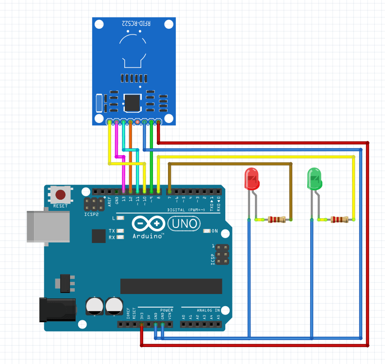

Program untuk perangkat IoT yang berfungsi untuk mennyalakan LED melalui modul RFID RC522
Perangkat yang digunakan
1. Arduino UNO
2. Modul RFID RC522
3. LED
4. Kabel jumper untuk penghubung antar perangkat

